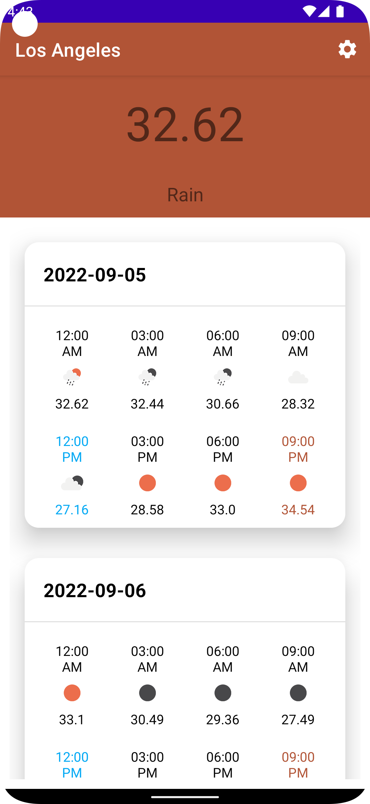
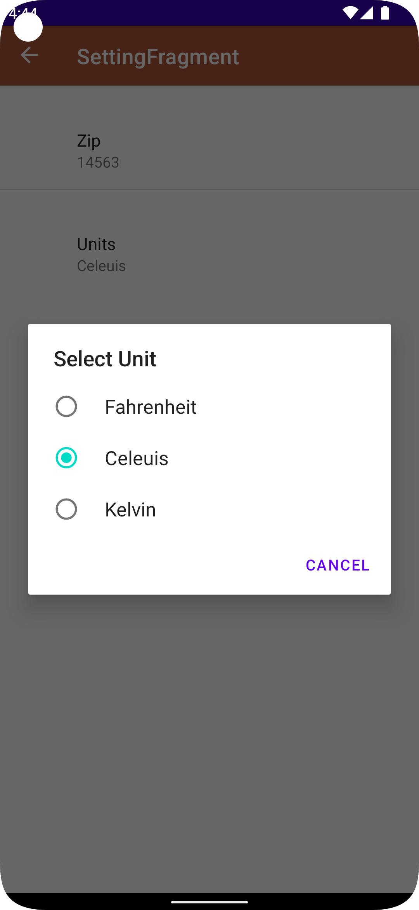
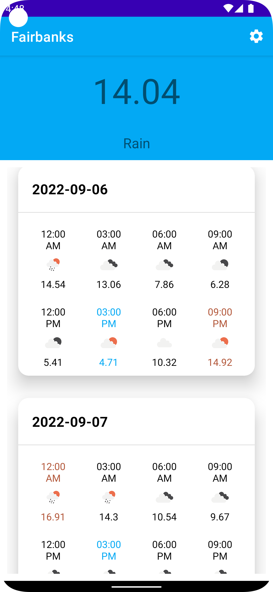
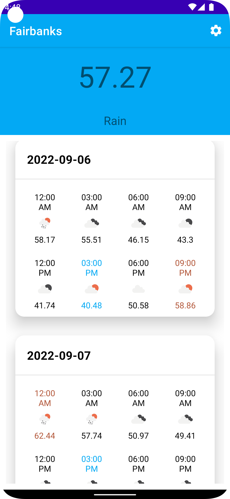

# Umbrella


## Technology
Data binding, Kotlin, Retrofit, Fragment, Navigation Graph, Preference Setting

## API

https://openweathermap.org/forecast5

```
api.openweathermap.org/data/2.5/forecast?lat={lat}&lon={lon}&appid={API key}
```






